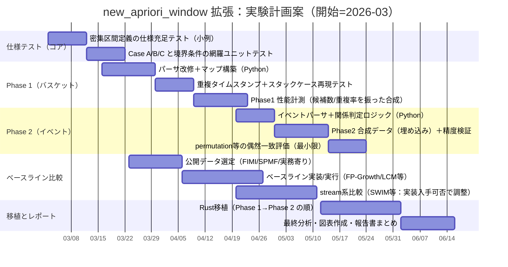

# new_apriori_window 拡張に関する技術調査報告書

## エグゼクティブサマリー

本報告書は、添付3ファイルに記載された new_apriori_window の拡張仕様（密集区間検出＋Apriori探索、Phase 1 の「バスケット構造」対応、Phase 2 の「外部イベントとの時間的関係」付与）を、アルゴリズム仕様として厳密に抽出し、関連する頻出パターン（Frequent Itemset/Pattern）マイニング研究を体系的に比較・評価する。fileciteturn0file0fileciteturn0file1fileciteturn0file2

new_apriori_window のコアは、アイテム（またはアイテム集合）の**出現位置列**に対し、ウィンドウ幅 \(W\) の区間 \([l, l+W]\)（右端含む）内の出現回数 \(count(l)\) が閾値 \(\theta\) 以上となる**左端 \(l\)** の集合を求め、これを**左端 \(l\) の連続区間**（最大連結成分）として出力する点にある。密か否かの判定は \(count(l)\) で行い、余剰 \(surplus=count-\theta\) に応じたストライド更新（Case C）で探索を加速する設計が明示されている。fileciteturn0file0

拡張のうち Phase 1 は、1トランザクション内に複数の「バスケット（購入単位）」が混在する現実的状況で、従来の「同一トランザクション内なら共起」とする定義が誘発する**偽共起**を抑制するため、共起定義を「同一バスケット内での共起」に変更し、バスケットIDを介して共起タイムスタンプを構成する。これにより同一トランザクションでの複数共起に起因する**重複タイムスタンプ**が発生しうるため、密集区間計算側にスタックケース（\(window\_occurrences[surplus] == l\)）のフォールバック（\(l+=1\)）が仕様として追加されている。fileciteturn0file1fileciteturn0file2

Phase 2 は、検出された密集区間（\([ts_i,te_i]\)）を外部イベント（\([ts_j,te_j]\)）に対して **Follows / Contains / Overlaps** の時間的関係で関連付けし、列挙出力する。許容誤差 \(\epsilon\) と最小重複長 \(d_0\) をパラメータ化し、ナイーブな全探索の計算量が明示されている（イベント数が小さい場合に実用的という位置づけ）。fileciteturn0file1fileciteturn0file2 なお、これら3関係＋\(\epsilon,d_0\) の定義は、時間区間関係（Allenの区間代数）を実務上扱いやすくする系統の研究とも整合する（Allen 1983、および \(\epsilon\) バッファと \(d_0\) を伴う Follows/Contains/Overlaps の定義例）。citeturn23search0turn24view0

関連研究の観点では、(i) バッチ型の完全列挙（Apriori、FP-Growth、垂直表現/Eclat、LCM等）、(ii) インクリメンタル（FUP、CanTree等）、(iii) ストリーム／スライディングウィンドウ（Lossy Counting、Moment、SWIM、CPS-tree、estDec 等）、(iv) 近年の近似・ニューラル／微分可能パターン探索（Differentiable Pattern Set Mining、neurosymbolic ARM など）が主要な比較軸になる。特にストリーム系は「ウィンドウモデル（スライディング／ダンプド／傾斜時間窓）」と「誤差保証（偽陰性/偽陽性、支持度誤差）」で設計思想が明確に分岐する。citeturn8search4turn14view0turn21view0turn11view0turn11view1turn19view0turn11view2

本拡張の新規性は、既存の頻出アイテム集合マイニング研究が主に扱う「（グローバルまたは一様な）支持度での頻出性」ではなく、**局所密度（ウィンドウ内回数）を満たす左端区間の列挙**という出力形式を中核に据えつつ、(a) トランザクション内部の観測単位（バスケット）をデータモデルとして顕在化し、(b) 検出区間を外部イベントと時間区間関係で結び付けることで、探索結果を「解釈可能な出来事の文脈」に接続する点にある。ただし、仕様書上、理論保証（完全性・正確性の証明、最悪計算量の漸近評価）は明示されていないため、研究としては（i）正確性の仕様充足テスト、（ii）重複タイムスタンプ下の探索停止性・網羅性、（iii）イベント関連付けの多重検定／偶然一致制御、といった評価設計が重要になる。fileciteturn0file0fileciteturn0file1fileciteturn0file2citeturn8search10turn25view0

## 仕様から抽出した new_apriori_window の定義と処理

new_apriori_window の対象は、時系列に並ぶトランザクション列であり、位置は整数インデックスとして扱われる。各アイテム（またはアイテム集合）について、出現したトランザクションの昇順インデックス列 \(t_1 < \dots < t_m\)（出現位置列）を构成する。ウィンドウは左端 \(l\) から右端 \(l+W\) までの閉区間で、\(f(l)=count(l)\) を「\(t_i \in [l,l+W]\) の個数」として定義する。fileciteturn0file0

### 密集区間の定義（出力の意味）

仕様上の「密集区間」は、時間区間（\([l,l+W]\)）そのものではなく、**ウィンドウ左端 \(l\) の集合**として表現され、さらに \(l\) が連続する区間（整数の連続区間）\([s,e]\) の集合として出力される。区間 \([s,e]\) は、(1) \(l=s,s+1,\dots,e\) の全てで \(count(l)\ge \theta\) を満たし、(2) 最大性として \(s-1\) および \(e+1\) は密でない（条件を満たさない）ことが要求される。fileciteturn0file0

出力CSVは `apriori_window` 既存仕様に準拠し、1行1アイテム集合、列は `pattern_components, pattern_gaps, pattern_size, intervals_count, intervals` である。`pattern_gaps` は `"[]"` 固定、`intervals` は `"(s,e);(s,e)"` の形式で、ここでの \(s,e\) は **左端 \(l\)** の区間端点を表す。出力対象は「アイテム数が2以上」のみで、出力順はアイテム数の降順とされる。fileciteturn0file0

### Apriori 段階的探索と候補区間 \(C(X)\)

探索は Apriori 方式で、サイズ1候補から開始し、各候補に対して密集区間抽出（`compute_dense_intervals` 相当）を行い、密集区間が1つ以上ある候補のみを保持する。次に \(k\rightarrow k+1\) の join を行い、全ての \(k\)-部分集合が頻出候補に含まれない候補を pruning する（Apriori 性質）。fileciteturn0file0

本仕様の特徴として、候補アイテム集合 \(X\) ごとに探索を行う \(l\) の範囲を、構成アイテムの「密になる左端 \(l\) の集合」 \(S(A)=\{l\mid f_A(l)\ge \theta\}\) の積集合として与える。例として \(X=\{A,B\}\) のとき \(C(X)=S(A)\cap S(B)\)。さらに、アイテム数2以上のときは \(C(X)\) のうち**長さが \(W\) 以上**の区間のみ候補として残し、\(C(X)\) が空なら探索対象外とする。fileciteturn0file0  
（注：この「長さが \(W\) 以上」の意味・必要性の理論的根拠は仕様中に明示されていないため、本報告書では「仕様上そうする」とのみ扱う。）

### 密集区間抽出のメインループ（Case A/B/C）

候補区間リスト \(C(X)\) を用意し、各候補区間 \([c_s,c_e]\) ごとに \(l=c_s\) から走査する。状態として `in_dense`（探索中か）、`start`（密集探索開始時点の左端）、`end`（探索中に観測された左端 \(l\) の最大値）を持つ。毎回 `count=count(l)` と `last_in_window = max{t_i \mid t_i \le l+W}` を求める。fileciteturn0file0

- **Case A: \(count<\theta\)**  
  密でない。`in_dense==true` なら \([start,end]\) を確定し、`in_dense=false` に戻す。その後、\(l\) を「次の出現位置（次の \(t_i\)）」へ進め、存在しなければ終了する。fileciteturn0file0

- **Case B: \(count=\theta\)**  
  密である（閾値ちょうど）。`in_dense==false` なら探索開始し、`start = w_{count-1-(surplus)} - W`、`end=l` とする（Case Bでは surplus=0）。既に探索中なら `end=max(end,l)` を更新する。走査は \(l=l+1\) として1トランザクションずつ検証し、\(count<\theta\) になった時点で Case A により確定する。`start` 設定の理由（右端を \(w_{count-1}\) に取っても \(count\ge \theta\) が成立する）は仕様内で説明されている。fileciteturn0file0

- **Case C: \(count>\theta\)**  
  密である（余剰あり）。初回は Case B 同様に `start = w_{count-1-(surplus)} - W`、`end=l` として探索開始し、次に `surplus=count-\theta` を計算する。現ウィンドウ内の出現位置を左から \(w_0,\dots,w_{count-1}\) とすると、左側 `surplus` 個を捨てるストライドとして \(l=w_{surplus}\) に更新する。`start` の妥当性（右から surplus+1 個目を右端に取れば \(\theta\) 個を含む）が仕様内で説明されている。fileciteturn0file0

探索終了時に `in_dense==true` なら最終の \([start,end]\) を確定し、これらを出力形式に従ってCSVへ書き出す。例外・境界条件として、出現位置列が空なら密集区間なし、`last_in_window` が存在しない場合は Case A 相当、前提として \(W\ge 1,\theta\ge 1\) が置かれる。さらに非機能要件として、同一入力に対し決定的出力であること、大規模でも現実的計算量で動作することが要求されるが、漸近計算量の明示はない。fileciteturn0file0

以下は、仕様中の Case A/B/C の状態遷移を可視化したフローである。fileciteturn0file0

```mermaid
flowchart TD
  A[候補区間 [c_s,c_e] を取り出す] --> B[l=c_s, in_dense=false]
  B --> C[count(l) と last_in_window を計算]
  C -->|count < θ| D[Case A: 非密]
  C -->|count = θ| E[Case B: 密(閾値ちょうど)]
  C -->|count > θ| F[Case C: 密(余剰あり)]

  D --> G{in_dense ?}
  G -->|true| H[区間(start,end)確定]
  G -->|false| I[何もしない]
  H --> J[in_dense=false]
  I --> J
  J --> K[lを次の出現位置 t_i へ]
  K -->|存在| C
  K -->|なし| Z[この候補区間を終了]

  E --> L{in_dense ?}
  L -->|false| M[start= w_{count-1} - W, end=l, in_dense=true]
  L -->|true| N[end=max(end,l)]
  M --> O[l = l+1]
  N --> O
  O --> C

  F --> P{in_dense ?}
  P -->|false| Q[start= w_{count-1-surplus} - W, end=l, in_dense=true]
  P -->|true| R[end=max(end,l)]
  Q --> S[l = w_surplus]
  R --> S
  S --> C

  Z --> T{in_dense ?}
  T -->|true| U[区間(start,end)確定]
  T -->|false| V[確定なし]
  U --> W[次の候補区間へ]
  V --> W
```

## 拡張要件と実装計画に含まれる追加仕様

拡張は大きく Phase 1（バスケット構造対応）と Phase 2（イベント関連付け）に整理され、Phase 1 完了後に Phase 2 に着手する方針、プロトタイプはPythonで作成しRustへ移植する方針が明示されている。fileciteturn0file1

### Phase 1：バスケット構造対応（偽共起の抑制）

現状の前提は「1行=1トランザクションで、空白区切りのアイテムID」であり、同一トランザクション内に複数の独立バスケットが混在する場合に、異なるバスケット間に偽の共起関係が生まれる問題が指摘されている。具体例として、同一トランザクション内の \(\{A,B\}\|\{C\}\) のような分割で、A-C が共起しないのに従来解釈では共起してしまうことが示される。fileciteturn0file2

新フォーマットでは、1行内でバスケットを `"|"` 区切りし、各バスケット内は空白区切りアイテムとする（例：`1 2 | 3 4 | 5`）。バスケット分割情報は入力データ側で保持し、パーサが読み取る。fileciteturn0file1

データ構造として、(a) `basket_to_transaction: List[TransactionId]`（バスケットID→トランザクションID）、(b) `item_basket_map: Dict[Item, List[BasketId]]`（アイテム→出現バスケットID列、ソート済み・一意）、(c) `item_transaction_map: Dict[Item, List[TransactionId]]`（単体アイテム用・重複なし）が提示される。アイテム集合の共起タイムスタンプは「各アイテムの出現バスケットID列の積集合」を取り、そのバスケットID列を `basket_to_transaction` でトランザクションID列へ変換するが、**重複を保持**する点が仕様上のポイントである（同一トランザクション内で複数バスケットに共起した場合、同じトランザクションIDが複数回現れる）。fileciteturn0file1fileciteturn0file2

この重複タイムスタンプの導入により、`compute_dense_intervals` 相当処理のストライド更新（Case C）の際に、`window_occurrences[surplus] == l` となって \(l\) が進まずスタックするケースが発生しうるため、スタック時は \(l+=1\)（Case B と同様）にフォールバックする修正が必要とされる。fileciteturn0file1

### Phase 2：密集区間と外部イベントの関連付け

Phase 2 では、密集区間 \([ts_i,te_i]\) と外部イベント \([ts_j,te_j]\) の間に、**Follows / Contains / Overlaps** の3種の時間的関係を判定して出力することが目的である。許容誤差 \(\epsilon\) と Overlaps の最小重複長 \(d_0\) を `settings.json` のパラメータとして追加する。fileciteturn0file1fileciteturn0file2  
（参考：Allenの時間区間関係は13関係を与える枠組みとして古典的であり、実装上は誤差バッファ等で運用上の頑健性を与える設計がよく採られる。citeturn23search0turn24view0）

イベント入力はJSON配列で、`event_id, name, start, end` を持つ。出力は `pattern_components, dense_interval, event_id, relation_type, epsilon` などのCSVで、関係種別ごとに `satisfies_*` を判定するブルートフォースが提示されている。計算量は \(O(|frequents| \times |dense\_intervals\_per\_itemset| \times |events|)\) と明示され、イベント数が少なければ実用的という立て付けである。fileciteturn0file1

## 関連研究サーベイ

頻出パターンマイニングは「支持度（support）を満たすアイテム集合を列挙する」枠組みが中心であり、データが無限・高速に到来するストリームでは、窓モデル（time-based / count-based など）と限られたメモリ下での近似・要約が主要論点になる。citeturn15view0turn15view1turn8search4turn14view0  
以下では、指定手法（Apriori, FP-Growth, Lossy Counting, Moment, SWIM, CPS-tree, estDec）を含め、比較上重要な代表手法を「アルゴリズムの要点・計算量/メモリ観点・長所短所・用途」で簡潔に整理する。

### バッチ（静的DB）に対する古典・高性能FIM

entity["people","Rakesh Agrawal","association rule mining"] と entity["people","Ramakrishnan Srikant","data mining researcher"] による Apriori（1994）は、頻出\(k\)-アイテム集合から候補\(k+1\)を生成し、複数回のDBスキャンで支持度を数え、Apriori性（反単調性：頻出集合の部分集合も頻出）で候補を剪定する「generate-and-test」型である。多段スキャンと候補爆発がボトルネックになりうるが、基本設計として最も参照される。citeturn15view0

entity["people","Jiawei Han","data mining researcher"]・entity["people","Jian Pei","data mining researcher"]・entity["people","Yiwen Yin","computer scientist"] の FP-Growth（2000）は、2回スキャンでFP-treeを構築し、条件付きFP-treeを再帰的に掘る「pattern-growth」型で、候補生成を回避することで Apriori より大幅に高速になり得ることが示される。特に長い頻出パターンや低支持度で差が広がるという実験的主張がある。citeturn15view1

entity["people","Mohammed J. Zaki","computer scientist"] の Eclat 系（垂直データ表現）は、各アイテムの TID 集合の交差で支持度を得る発想を基礎に、探索順序・分解・同値類などで高速化する。垂直形式は交差計算が主で、メモリと実装がやや複雑になりやすい一方、特定条件で高性能が期待される。citeturn19view3

entity["people","Takeaki Uno","computer scientist"] の LCM（例：LCM ver.3）は、頻出（/閉/極大）アイテム集合列挙を高速に行う実装研究として著名で、ベンチマーク（BMS-WebView、retail、kosarak 等）を用いた性能比較が報告されている。頻出集合の数が膨大になり得るデータ特性（dense/structured など）も議論される。citeturn25view0  
（補足：頻出集合の数そのものが巨大になり得るため、列挙型アルゴリズムは「最悪指数的」かつ「出力サイズ依存（output-sensitive）」になる、という問題設定は古くから強調され、簡潔表現（condensed representation）研究に接続する。citeturn8search10turn8search18）

### インクリメンタル・更新（バッチ更新／追加入力）

entity["people","D. W. Cheung","computer scientist"] らの FUP（1996）は、既知の大規模（large）アイテム集合とその支持度情報を再利用し、増分データ `db` のみのスキャンで「勝者/敗者」を判定し、候補集合を大幅に削ることで、全再計算より高速化する。論文中では、再実行と比較して 2〜16倍高速、候補数が大幅に減ったという実験結果が報告される。citeturn20view1

CanTree（canonical-order tree）は、アイテムをカノニカル順に並べる木構造で、FP-tree系をインクリメンタルに扱うことを狙う。多くのインクリメンタル手法がAprioriベースである中で、FP-tree系の増分更新を支える構造として位置付けられている。citeturn16search1  
（注：本調査環境では当該論文PDF本文の安定取得に失敗したため、詳細な式や擬似コードを正確に引用できない。入手できた公式要約記述に限定している。citeturn16search1）

### ストリーム／スライディングウィンドウと要約・近似

ストリーム処理の一般的論点（無限長・高到来率・メモリ制約・遅延など）は、データストリームシステムのモデル整理でも体系化されている。citeturn8search4

entity["people","Gurmeet Singh Manku","computer scientist"] と entity["people","Rajeev Motwani","computer scientist"] の Lossy Counting（2002）は、頻度カウントを近似しつつ誤差をパラメータで制御する決定的アルゴリズムとして提示され、頻出アイテム（単一）だけでなく、可変長トランザクションにおける頻出アイテム集合も単一パスで扱う方向と実装上の工夫が議論される。誤差保証付きでストリーム頻度を扱う古典である。citeturn21view0  
さらにストリームFIMの代表的整理では、Lossy Counting系が「偽陰性なし・支持度誤差上界・一定以下の偽陽性制御」といった保証を持つ一方、誤差パラメータを小さくするとメモリ/CPUが増えるトレードオフが明示される。citeturn14view0

entity["people","Yun Chi","computer scientist"] らの Moment（およびジャーナル拡張 “Catch the moment”）は、スライディングウィンドウ上で**閉頻出アイテム集合（Closed FIs）**を維持するために、Closed Enumeration Tree（CET）というコンパクト構造を導入し、閉頻出集合とそれ以外の境界（boundary）近傍のみを重点監視することで計算量を削減する、という設計思想を明示する。概念ドリフトは境界の移動として反映され、境界が比較的安定であるという仮定の下で効率化を狙う。citeturn11view0

entity["people","Barzan Mozafari","computer scientist"]・entity["people","Hetal Thakkar","computer scientist"]・entity["people","Carlo Zaniolo","computer scientist"] の SWIM（2008）は、巨大スライディングウィンドウを複数スライド（slide）に分割し、各スライドで頻出パターンをマイニングしつつ、全窓での頻度が未確定な「新パターン」は補助配列（aux array）等で段階的に検証する。小さな報告遅延を許すと性能が上がり、遅延0にも設定可能であること、また「大きいスライディングウィンドウ上で exact（厳密）かつ効率的」と述べている。citeturn11view1turn22view0  
SWIMは「検証（verifier）」を核としており、パターン木をFP-treeに突き合わせて頻度を検証する手法（DFV/DTV等）と、その計算量式（DFVの合計時間として \(\sum_x q(x)\,f(x)\,|FP.head(x)|\) など）が述べられている。citeturn22view2

entity["people","Syed Khairuzzaman Tanbeer","computer scientist"]・entity["people","Chowdhury Farhan Ahmed","computer scientist"]・entity["people","Byeong-Soo Jeong","computer scientist"]・entity["people","Young-Koo Lee","computer scientist"] の CPS-tree（2008）は、スライディングウィンドウをpane（非重複バッチ）に分解し、単一パスで挿入しつつ動的木再構成でFP-tree類似の「頻度降順でコンパクトな木」を維持して、最近窓の**正確（exact）な頻出パターン**を掘ることを主張する（DSTreeの不十分なコンパクト性を改善するという位置づけも明確）。citeturn19view0

entity["people","Joong Hyuk Chang","computer scientist"] と entity["people","Won Suk Lee","computer scientist"] の estDec（2004）は、古いトランザクションの寄与を減衰させる「damped window」的発想で、recent frequent itemsets を抽出する情報減衰法として位置付けられている（減衰率を調整し、情報の寿命を実務的に制御できる旨）。citeturn11view2  
一方で、ストリームFIMの総説では estDec の推定頻度が部分集合からの推定に依存することにより誤差が増幅・伝播し得て偽陽性が増える点、さらに逐次更新が高速ストリームに耐えない可能性が指摘され、支持度誤差の導出式や偽結果集合の定義も整理されている。citeturn14view0

また、FP-stream は tilted-time window（傾斜時間窓）により、最近を細かく古い時期を粗く要約して複数粒度の時系列クエリに応答する枠組みで、誤差保証付きで time-sensitive query を扱うという主張がある。citeturn15view2turn14view0  
（ユーザ指定リストにはないが、Phase 2 のイベント関係付与や、時間的問い合わせの要求と比較すると重要な参照軸になる。）

### 近年の近似・ニューラル／微分可能パターン探索

頻出パターン探索の課題（パターン爆発・高次元・実行時間）は現在も続き、近年は「列挙そのもの」よりも、(i) 近似で支持度計算を省略、(ii) パターン集合を最適化問題として解く（微分可能化・メタヒューリスティクス）、(iii) ルール集合の圧縮やneurosymbolic化、といった潮流が見られる。

近似FIMの例として ProbDF は、サイズ1・2の頻出集合を確定した後はトランザクションデータを保持せず、確率的支持度予測（PSPM）でサイズ3以上の支持度を確率的に推定することで、特にdenseデータで効率を狙う。論文は、denseデータでは頻出集合が極端に増えること、支持度計算が最重いこと、近似は偽陰性/偽陽性のトレードオフを持つことを述べている。citeturn27view0

微分可能なパターン集合探索としては、Differentiable Pattern Set Mining が、大規模行列（数百万行×数百特徴）から高品質なパターン集合を勾配最適化で探索する方向を提示する（列挙型と異なる計算モデル）。citeturn7search5turn11view3

neurosymbolicな関連ルール学習として、entity["people","Erkan Karabulut","computer scientist"]・entity["people","Paul Groth","computer scientist"]・entity["people","Victoria Degeler","computer scientist"] による Aerial+（2025頃の公開稿）は、オートエンコーダで特徴間の関連を表現し、再構成機構からルールを抽出して「ルール爆発」を抑えつつ高品質ルール集合を得ることを狙う。高次元表形式データでの実行時間削減を強調し、GPU/並列実行も論点に含む。citeturn26view0  
さらに論理ルール学習の文脈では、entity["people","Amir Sadeghian","computer scientist"] らの DRUM が、ルール構造とスコアを同時に学習する「end-to-end differentiable rule mining」を提案するが、これは知識グラフ上のHorn clause学習であり、トランザクションFIMとは目的・データモデルが異なる（ただし“パターン”を学習で得る潮流として比較価値がある）。citeturn26view1

## new_apriori_window との比較

### 位置づけの要点

new_apriori_window は「頻出アイテム集合（support≥minsup）」そのものの列挙ではなく、「**局所窓における密集（count≥θ）を満たす左端 \(l\) の区間集合**」を返す点で、出力仕様が多くのFIM手法と異なる。fileciteturn0file0  
一方で探索骨格は Apriori 的であり、候補生成・部分集合剪定という“頻出集合探索の枠”を局所密集の存在判定に転用している。fileciteturn0file0citeturn15view0

Phase 1/2 の拡張は、(i) 共起の観測単位（バスケット）を導入して偽共起を抑える、(ii) 検出区間を外部イベントへ写像して解釈・下流分析を可能にする、という「現実の分析パイプライン上の欠け」を埋める性質が強い。fileciteturn0file1fileciteturn0file2

### 比較表（指定ディメンション）

以下の表は、指定軸（データモデル、支持度/頻出性定義、更新戦略、時間・空間、近似性、スケール、並列化、実装難易度）で整理したものである。文献側の計算量は「最悪指数（列挙数依存）」になり得る点は共通で、近似法は誤差保証または経験的主張のいずれかを持つ。citeturn8search10turn21view0turn11view0turn11view1turn19view0turn14view0turn27view0

| 手法 | データモデル | 頻出性/支持度の定義 | 更新戦略 | 時間計算量（概観） | 空間（概観） | 正確性/近似 | スケール/適用条件 | 並列化 | 実装難易度 |
|---|---|---|---|---|---|---|---|---|---|
| **new_apriori_window（本仕様）** | オフライン（全トランザクション列）＋固定幅窓 | 窓 \([l,l+W]\) 内の回数 \(count(l)\ge\theta\) を満たす左端 \(l\) の区間集合 | バッチ走査（Case C のストライドで前進） | 仕様に漸近評価の明記なし（候補数・出現数・候補区間長に依存） | 出現位置列、候補区間、候補生成の保持が主 | 仕様上は閾値判定に基づく決定的出力 | 局所密度（バースト）検出向き、低閾値・高次で候補爆発リスク | 候補ごとに独立評価は可能 | 中〜高（候補区間交差、Case処理、出力整形） |
| **new_apriori_window + Phase1（バスケット）** | オフライン＋トランザクション内にバスケット階層 | 共起を「同一バスケット内」に変更、transaction_id 列に重複あり | ケーススタック回避（\(l+=1\) フォールバック） | 仕様に漸近評価の明記なし（交差計算＋重複で増える可能性） | basket_id列・写像・transaction_id列（重複）を保持 | 正確性は仕様上明示なし（ただし決定的） | 偽共起抑制、購入単位が混在するデータに適合 | 交差と候補ごと並列は可能 | 高（パーサ、写像、重複、スタック処理） |
| **new_apriori_window + Phase2（イベント関連付け）** | オフライン（密集区間×外部イベント） | Follows/Contains/Overlaps を \(\epsilon,d_0\) で判定 | 全探索（ブルートフォース） | \(O(|frequents|\cdot|intervals|\cdot|events|)\) | 出力が増えると保持も増 | 判定は決定的（ただし統計的有意性は別問題） | イベント数が小さい前提で実用 | イベント側分割などで並列容易 | 低〜中（判定関数＋出力） |
| Apriori | バッチ | 全期間支持度（minsup以上） | 反復DBスキャン＋候補生成 | 多段スキャン、候補生成が支配的になり得る | 候補集合・カウント構造 | 正確（列挙） | 疎データ・中規模、低minsupで困難 | パス/分割で並列可 | 中 |
| FP-Growth | バッチ | 全期間支持度（minsup以上） | FP-tree構築＋条件付き木の再帰 | 候補生成回避、実験的にAprioriより高速な場合 | FP-treeが主要 | 正確（列挙） | 長パターン・低minsupで有利になり得る | 条件付き木ごと並列余地 | 中〜高 |
| Eclat（垂直/TID交差） | バッチ | 全期間支持度（minsup以上） | TID集合の交差を反復 | 交差計算主体（データ特性依存） | TID集合保持が重い場合 | 正確（列挙） | 交差が効く条件で高速化 | 交差単位で並列可 | 中〜高 |
| FUP | バッチ増分（DB+追加db） | 全期間支持度（同minsup前提） | 旧結果再利用、増分で候補を削る | 再計算より高速化（実験報告あり） | 旧large itemsets保持が必要 | 正確（更新） | 閾値固定・増分更新に適合 | 増分スキャン等で並列余地 | 中 |
| Lossy Counting | ストリーム（履歴/近似） | 頻度が閾値以上の要約（誤差\(\epsilon\)制御） | バケット化＋削除により要約維持 | 1-pass、誤差と候補数に依存 | 小さなメモリフットプリントを主張 | 近似（誤差保証） | 高速ストリーム・近似許容 | 分散集約など拡張あり | 中 |
| Moment（CET） | ストリーム＋スライディング窓 | 窓内の閉頻出集合 | 境界近傍のみ重点更新 | 境界が安定なら効率化 | CETなど専用構造 | 正確性は「閉頻出集合維持」を目標（詳細は原論文依存） | 概念ドリフトを境界移動として扱う | 更新部は並列化余地限定 | 高 |
| SWIM | ストリーム＋巨大スライディング窓（スライド分割） | 近窓での頻度（厳密を主張、遅延許容） | 新スライドで頻出抽出＋検証（aux配列） | 検証アルゴリズムが鍵（式提示あり） | パターン木＋補助配列 | exact を主張（遅延報告あり） | 大窓・厳密性が要る監視 | スライド単位で並列可 | 高 |
| CPS-tree | ストリーム＋窓（pane分割） | 最近窓の頻出パターン（exact主張） | 単一パス挿入＋動的再構成 | pane更新＋FP-growth系採掘 | CPS-tree保持が主要 | exact主張 | 高速ストリーム＋窓更新 | pane/分岐並列余地 | 高 |
| estDec | ストリーム＋減衰（damped） | 減衰支持度（recent FI） | 逐次更新＋推定・剪定 | 推定誤差が伝播し得る指摘 | 保持集合D、推定用フィールド | 近似（偽陽性増の懸念） | “最近重視”用途、精度注意 | 更新を分散しにくい面 | 中 |
| Differentiable Pattern Set Mining | バッチ（最適化） | 目的関数で“良いパターン集合”を最適化 | 勾配法 | 列挙と異なる（最適化反復） | 勾配計算用の表現 | 近似（最適化解） | 大規模表データでの圧縮表現 | GPU等並列が本質的 | 高 |
| Aerial+（neurosymbolic ARM） | バッチ（表→トランザクション化も可能） | ルール集合（support/conf等＋品質指標） | NN表現学習→ルール抽出 | 学習＋抽出（論文は高速化主張） | NNモデル＋抽出中間物 | 近似（学習に依存） | 高次元でルール爆発抑制を狙う | GPU/並列を明示 | 高 |

（注：new_apriori_window の計算量・空間量の“理論的オーダー”は添付仕様に明示がなく、実装の \(count(l)\) 計算方法や候補数上限（例：max_length）に依存するため、本表では「明記なし」として扱った。fileciteturn0file0fileciteturn0file1）

## 既存手法の限界とオープン問題

### パターン爆発と「列挙」の限界

頻出アイテム集合の数は、支持度閾値が低い場合やデータが高相関・高密度の場合に爆発し得て、列挙そのものが計算・メモリ・出力の律速となる。この問題意識は、非導出（non-derivable）などの簡潔表現を研究する動機として明確に述べられている。citeturn8search10turn8search18turn25view0  
new_apriori_window も Apriori 的探索を含むため、候補数爆発のリスク自体は構造的に共有しうる（ただし“頻出性”の定義が局所密集であるため、実データ上は候補が減る可能性もあるが、これは仕様からは断定できず実験検証が必要）。fileciteturn0file0

### ストリーム窓モデルの選択と、精度—資源トレードオフ

ストリームFIMは、(i) スライディング窓で“直近のみ厳密”、(ii) 減衰窓で“古いほど軽く”、(iii) tilted-time windowで“多粒度要約”といったモデル差が大きく、同じ「最近重視」でも保証・運用が異なる。citeturn8search4turn14view0turn15view2  
Lossy Counting のような誤差保証型は、誤差パラメータを下げるほど候補保持・更新コストが上がるジレンマが明示される。citeturn14view0turn21view0  
estDec のような推定型は、推定誤差の伝播により偽陽性が増え得ること、逐次更新が高速ストリームに耐えない可能性が指摘されている。citeturn14view0turn11view2

### 窓内頻出性と“局所密集区間”の統一的取り扱い

既存のスライディング窓FIM（Moment, SWIM, CPS-tree 等）は「窓内の頻出集合（あるいは閉頻出集合）」を保持・更新する設計が多いが、new_apriori_window は「左端 \(l\) の連続区間として密集を出す」形式であり、**出力が“時間に沿った区間集合”**である点が異なる。窓ベース頻出集合研究と、区間列挙（局所バースト）出力を、理論的にどう接続するか（境界・網羅性・簡潔表現）は、既存研究の中心テーマとはズレがあり、オープンな整理課題になり得る。fileciteturn0file0citeturn11view0turn11view1turn19view0

### 実務上の“観測単位”問題（Phase 1 の位置づけ）

トランザクション内部に複数の独立バスケットが混在している状況は、データ収集・ログ設計の都合で起こり得るが、従来のFIM文献の多くは「1トランザクション=1バスケット」を暗黙に置いている。Phase 1 はこの暗黙仮定を崩し、共起の観測単位を明示する実務的に重要な拡張である。fileciteturn0file2  
ただし、バスケット粒度の共起を transaction_id に写像し重複を許す設計は、窓内カウントの意味（“何を何回数えたか”）を変えるため、統計的解釈（例：同一トランザクション内の複数回共起を別カウントしてよいか）や、密集区間検出の停止性（スタックケース）に注意が必要であることが仕様上も指摘されている。fileciteturn0file1fileciteturn0file2

### イベント関連付けの“偶然一致”と多重比較

Phase 2 は全列挙（密集区間×イベント×関係種別）であり、特に頻出パターン数や区間数が大きい場合、偶然一致の報告が増えやすい。仕様でも有意性評価（統計検定、permutation test 等）が Future Work として挙げられている。fileciteturn0file2  
これは、時間区間関係自体が豊富である（Allenの13関係など）こと、また誤差許容 \(\epsilon\) や最小重複 \(d_0\) が関係判定を緩める方向に働き得ることから、実験計画では「発見の妥当性（再現性・偶然一致制御）」が中心課題になる。citeturn23search0turn24view0

## 提案拡張の新規性評価と実験計画

### 新規性・解決する問題・要求仮定

本提案の拡張が解決を狙う問題は、仕様上少なくとも次の2点に分解できる。

第一に、「観測単位のミスモデリングによる偽共起」を抑制すること。従来の共起定義（トランザクションIDの交差）では、同一トランザクションに含まれるが別バスケットのアイテムまで共起扱いになるが、Phase 1 は「同一バスケット内共起」に置き換え、バスケットIDの交差を介して共起を定義する。これにより、解釈上の誤り（偽共起）が減ることが期待されるが、期待効果の程度はデータ依存であり、仕様だけからは確定できない。fileciteturn0file1fileciteturn0file2

第二に、「密集区間の解釈を外部イベントに接続する」こと。Phase 2 は、密集区間とイベントの関係を Follows/Contains/Overlaps で列挙し、購買密集がイベント前後・期間内・部分重複かを機械的に付与する。これは Allen の区間関係の応用として自然であり、\(\epsilon\) バッファや \(d_0\) 最小重複を導入して“境界の不確かさ”を吸収する設計も既存研究例と整合する。fileciteturn0file2citeturn23search0turn24view0

要求仮定として仕様から確実に読み取れるのは、(a) トランザクション位置が整数で順序付くこと、(b) \(W\ge 1,\theta\ge 1\)、(c) Phase 1 では入力にバスケット区切りが正しく埋め込まれていること、(d) Phase 2 ではイベントの start/end が同じ時間軸（整数または同等スケール）で与えられること、である。fileciteturn0file0fileciteturn0file1

理論保証（例：密集区間抽出が定義通りの最大区間集合を必ず返すこと、Phase 1 の重複タイムスタンプ下でも漏れなく区間を返すこと、など）の**証明や不変条件**は添付仕様に記載がないため、本報告書では「未指定」とする。fileciteturn0file0fileciteturn0file1

### 想定される失敗モードと実装上の落とし穴

Phase 1 の主要リスクは、重複タイムスタンプによりストライド更新が進まず探索が停滞するケースで、仕様では `window_occurrences[surplus] == l` のスタックケースとして明示され、\(l+=1\) のフォールバックが必要とされる。ここはバグとして再現しやすい箇所であり、最小ケース（同一トランザクション内に複数バスケットで同一アイテム集合が共起する）をユニットテスト化すべきである。fileciteturn0file1

また、バスケットID交差→transaction_id写像（重複保持）は、処理系によっては一時リストが肥大化しやすい。交差はソート済みリストとして設計されているため、線形マージ交差が可能だが、候補生成が増えた場合の累積コストは無視できない（ただしこの点は仕様に定量がないため、計測ベースで判断する必要がある）。fileciteturn0file1

Phase 2 の主要リスクは、(i) 全探索出力の爆発（密集区間数×イベント数×関係種）、(ii) \(\epsilon,d_0\) による関係判定の過剰緩和、(iii) 偶然一致の大量報告、である。仕様でも有意性評価が Future Work とされているため、最初の実験段階から「偶然一致コントロール」を評価指標に組み込むことが望ましい。fileciteturn0file2citeturn24view0

### 実験提案：評価指標・データセット・ベースライン

#### 評価タスク設計

本拡張は2段（Phase 1/2）で目的が異なるため、最低でも以下の3軸で分けて評価するのが合理的である。

1) **密集区間抽出の妥当性（仕様充足テスト）**  
手作り小規模例で、定義（\(count(l)\ge\theta\) が区間内の全 \(l\) で成立し、最大性も満たす）どおりの区間が出ることを検証する。これはアルゴリズム研究というより“仕様の正確実装”テストである。fileciteturn0file0

2) **Phase 1：偽共起抑制の効果**  
同一トランザクション内でバスケットが混在する合成データを生成し、真の共起（同一バスケット）と偽共起（別バスケット）をラベル付けして、従来定義（トランザクション交差）と Phase 1 定義が返す頻出候補・密集区間の差を測る。仕様が提示する問題設定そのものを再現する実験である。fileciteturn0file2

3) **Phase 2：イベント関連付けの再現性・偶然一致制御**  
イベントと密集を既知の関係で埋め込む合成データ（例：ある期間の直前に特定アイテム集合が高密度で出るよう注入）を作り、Follows/Contains/Overlaps 判定の正解率を測る。さらに、イベントをランダムシフトした対照を用意し、permutation test 的に「発見の頑健性」を測る（仕様でも候補として挙げられている）。fileciteturn0file2

#### 指標（Metrics）

- **計算資源**：実行時間（候補数別・\(W,\theta\)別）、ピークメモリ、I/O量（必要なら）。ストリーム系比較ではスループット（txn/sec）も有用だが、new_apriori_window自体はオフライン前提なので“スループット相当”として測る。fileciteturn0file0citeturn8search4
- **結果サイズ**：アイテム集合数、密集区間数、区間長分布（左端区間の長さ \(e-s+1\)）。  
- **正確性（合成データ）**：  
  - Phase 1：偽共起検出率（False co-occurrence rate）、真共起保持率。  
  - Phase 2：関係判定の precision/recall、イベントごとの上位K関連パターンの hit-rate。  
- **統計的頑健性**：イベントシフト等の帰無分布に対するp値推定、またはFDR制御（ただし、仕様では有意性評価は Future Work なので、まずは最小限のpermutationベースで十分）。fileciteturn0file2

#### データセット候補

- **頻出パターン基礎性能（速度・スケール）**：FIMIの公開ベンチマーク（retail 等）および SPMF の公開データセットは、比較実験の標準的候補である。citeturn10search0turn10search1turn28search3  
- **実務寄りの購買トランザクション**：entity["company","Instacart","grocery delivery company"] の “Instacart Online Grocery Shopping Dataset 2017” は注文（order）単位のトランザクションを含む公開データとして広く知られる。citeturn28search4  
- **マーケ施策・顧客属性込み**：entity["company","dunnhumby","customer data science company"] の “The Complete Journey” は、世帯レベル購買の履歴やマーケ接触情報を含むデータとして提供されている。Phase 2 的なイベント（キャンペーン）との関連付けを模擬しやすい。citeturn28search1  

（注：上記公開データは“1トランザクション内に複数バスケット”という Phase 1 の前提をそのまま満たすとは限らない。Phase 1 の効果検証は、バスケット混在を意図的に注入した合成データ、または入力ログ設計上そのような混在があり得るドメインデータが必要になる。これは仕様からも示唆されるが、公開データだけで完結するとは限らない。fileciteturn0file2）

#### ベースライン（比較対象）

- **静的FIM**：Apriori、FP-Growth、（可能なら）Eclat、LCM（実装が入手しやすく高速）。citeturn15view0turn15view1turn19view3turn25view0  
- **ウィンドウ/ストリーム**（Phase 2 の“最近性”に近い比較軸）：Lossy Counting（誤差保証型）、Moment（閉頻出集合）、SWIM（大窓・厳密）、CPS-tree（窓・厳密）、estDec（減衰・近似）。citeturn21view0turn11view0turn11view1turn19view0turn14view0turn11view2  
- **近年の近似・学習系**：ProbDF（dense向け近似）、Differentiable Pattern Set Mining（パターン集合最適化）、Aerial+（ルール爆発抑制）など。ただし目的（列挙 vs 要約/最適化）が異なるため、同一KPIでの単純比較ではなく「代替アプローチとしての位置づけ比較」が適切。citeturn27view0turn11view3turn26view0

### 提案する実験計画とタイムライン

最後に、添付のPhase順序（Phase 1→Phase 2）と、研究評価（ベースライン比較、合成データ検証、有意性評価）を組み込んだ、12週間程度の実行可能な計画案を示す。fileciteturn0file1



（注：上記は“実装がすでに存在するベースラインを優先する”前提の計画である。SWIM/CPS-tree/Moment 等の既存実装の利用可否によって、比較の深さ（コードレベル vs 論文再現）を調整する必要がある。これは情報源が実装の公開を保証しないため、本報告書では不確実要素として明示している。citeturn11view1turn19view0turn11view0